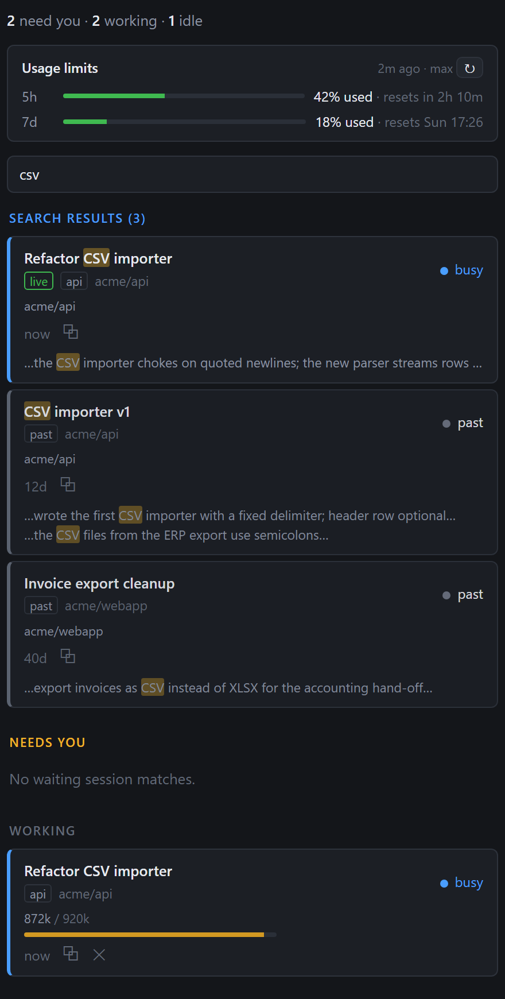

# Session Board

**Every Claude Code session you have running, in one VS Code sidebar: who needs you, who is
still working, and how much room each one has left.**

## The problem

Claude Code makes it easy to run several sessions at once: one per repository, one per
ticket, one for the long refactor you check on every hour. VS Code puts each of them in its
own window or tab, and you only find out that one has been waiting for your answer when you
happen to switch to it. Which sessions are blocked on a permission prompt right now? Which
are still working? Which one is about to run out of context? Claude Code's own agents list
shows background agents only, not the sessions you talk to.

## What Session Board does

- **Needs you comes first.** Sessions waiting on a permission prompt, a question or a dialog
  sit at the top, highlighted, with what they are waiting for. Working and idle sessions
  follow. The activity-bar badge counts the waiting ones and a toast tells you when a new
  session starts waiting.
- **One click to the session.** A row opens its session where you keep Claude Code, sidebar
  or editor tab, and brings the right VS Code window to the front.
- **Context at a glance.** Each row shows how much of the context window the session has
  used, amber and red near the limit.
- **Your usage limits.** The 5-hour and 7-day windows sit at the top of the view with the time
  each one resets.
- **End a session.** ✕ ends a session and everything it started. Busy sessions ask twice.
- **Find any session, ever.** Type to narrow the list. Press Enter to search every session on
  this machine, current or past, by title or by what was said, and resume a past one in
  place.

## Install

You need Windows, VS Code 1.100 or newer, the Claude Code extension, and the `claude`
command on your PATH.

- **Marketplace**: search for *Session Board* in the Extensions view (once published).
- **From source**: `pwsh -File build.ps1` packages the extension and installs it; see
  [DEVELOPMENT.md](DEVELOPMENT.md).

Session Board appears as a new icon in the activity bar.

## Usage limits

The strip at the top shows your 5-hour and 7-day usage windows with the time each resets,
plus per-model weekly windows and extra usage when your plan has them. Session Board asks
the Claude Code command line for these numbers the same way Claude Code's own usage screen
does: a short, hook-free run that makes no model call and uses the CLI's own login. It
refreshes every 5 minutes while the view is visible, and on ↻. Subscription plans only;
API-key billing has no limits to report.

## Privacy

Everything stays on your machine. Session Board reads the session files and command-line
output that Claude Code keeps in your user profile, and talks to nothing else. It reads no
credentials and sends nothing anywhere.

Session Board is an independent project. It is not affiliated with or endorsed by Anthropic.

## Good to know

- Windows first: on macOS and Linux the list, the usage strip and the search work, but the
  window mapping and ending sessions do not yet; a click copies the resume command instead.
- Built against Claude Code 2.1.276 to 2.1.280. The board relies on the local files and
  command output Claude Code produces, which can change with a release; when they do, the
  board says so instead of guessing.
- Developers: [DEVELOPMENT.md](DEVELOPMENT.md) has the layout, the build, how the pieces work
  and the publishing steps. Changes are listed in
  [extension/CHANGELOG.md](extension/CHANGELOG.md).

MIT license.
