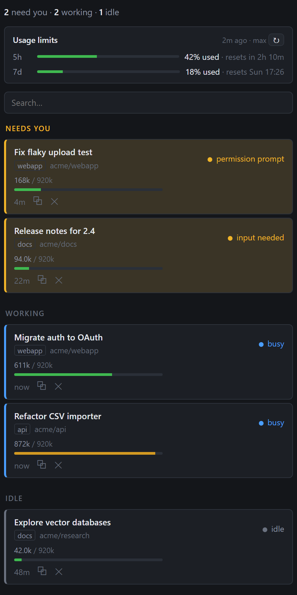

# Session Board

Your Claude Code sessions at a glance, across every VS Code window: who is waiting for you,
who is working, how much context each has used, and how much of your usage limits is left.
Click a row to jump to that session, ✕ to end it, and search every session on disk by title
or content.

Session Board is an independent, unofficial tool. It is not affiliated with or endorsed by
Anthropic; it reads the local files and CLI output that Claude Code leaves on your machine.

## Prerequisites

- Windows. Listing and search run anywhere, but the window mapping and ending a session use
  `Win32_Process` and `taskkill`; on other platforms a click copies the resume command.
- The Claude Code CLI (`claude`) on the PATH VS Code sees, and the Claude Code extension
  installed (the board opens sessions through it).
- ripgrep (`rg`) on PATH for content search; VS Code's bundled copy is used when found.
  Title search works without it.
- Tested with Claude Code 2.1.276 to 2.1.280 on VS Code 1.138. The board relies on
  undocumented Claude Code internals (`claude agents --json`, transcript line types, the
  extension's open command and URI handler), so a Claude Code release can break it; when
  the session output changes shape the board says so instead of guessing.

## What you see

- **Needs you** on top with what each session is blocked on (`permission prompt`,
  `input needed`, `dialog open`), then **Working**, then **Idle**; idle rows over 2 h fold
  behind a toggle.
- Each row: the session's name (`/rename` wins over the generated title; a session with
  neither shows its last prompt), the VS Code window it lives in, its folder, status, a
  context bar, and time in that state. Hover for the folder and the internal agent name.
- The badge on the activity-bar icon is the number of sessions waiting on you. When a
  session newly starts waiting, the focused window shows a toast with an Open button.

## Actions

- **Click a row**: the session opens where you keep Claude Code (sidebar or editor tab), in
  the window that owns it, and that window comes to the front. Without a mapped window the
  resume command is copied instead.
- **⧉** copies `claude --resume <id>`.
- **✕ ends the session** and everything it started (its subagents and tool processes).
  Click once, then click `End?` within 3 s. Busy or waiting sessions ask once more; in-flight
  work is lost. The transcript stays and Claude Code's picker still offers "Resume session".
  Archiving is not something the board can do; use Claude Code's picker for that.
- **Search**: typing narrows the live list. Enter searches every session on disk by title,
  folder, id and transcript text (literal, case-insensitive, raw transcript text including
  tool output); Esc or an emptied box clears. Results show live or past, the folder, up to
  two snippets, and whether the pass was partial. Click a past session to resume it in this
  window when its folder is open here; otherwise the resume command is copied and you can
  open the folder in a new window as the first step. Archived and unarchived past sessions
  look the same: the archive flag is private to Claude Code.
- Command palette: **Session Board: Open Session…**, **Session Board: Search Sessions…**,
  **Session Board: Refresh Usage Limits**, **Session Board: Refresh**. Output panel channel
  **Session Board** logs each decision.

## Context marks

The bar appears when `autoCompactWindow` is set in `~/.claude/settings.json`; it turns amber
at the save mark (`CONTEXT_GUARD_THRESHOLD_TOKENS`, default 92 % of the window) and red at
the window. Without the setting the row shows the token count only.

## Usage limits

The strip at the top shows how much of your 5-hour and 7-day usage windows is used and when
each resets, plus per-model weekly windows and extra usage when your plan has them. Session
Board asks the `claude` command line for these numbers the same way Claude Code's own usage
screen does: a short, hook-free run that makes no model call, starts no MCP server, leaves
no transcript, and uses the CLI's own login. The board reads no credentials and sends nothing
anywhere. Refreshed every 5 minutes while the view is visible (15 when hidden) and on ↻;
when a refresh fails the last numbers stay, with the failure noted underneath. Subscription
plans only: with API-key billing Claude Code reports no limits.

## Limits

- Sessions started outside the VS Code extension (a terminal, a background agent) have no
  window; click copies the resume command.
- The window mapping reads the newest VS Code log run, so a second VS Code instance
  (Insiders, portable) is outside it.
- Each window polls independently (5 s while the view is visible, 15 s hidden).
- A cold content search over a multi-GB transcript corpus is disk-bound and can take seconds.
- The usage numbers come from a CLI reply that Claude Code marks as experimental; if a
  release changes its shape, the strip says so instead of showing wrong numbers.
